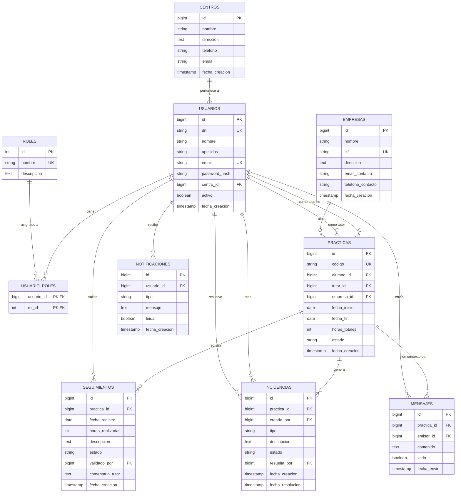

# Diagrama Entidad-Relación - TFG Nexus

Este documento contiene la representación visual del esquema de base de datos definido en `BBDD-TFG.sql`, utilizando la sintaxis de Mermaid.

```mermaid
erDiagram
    CENTROS ||--o{ USUARIOS : "pertenece a"
    USUARIOS ||--o{ USUARIO_ROLES : "tiene"
    ROLES ||--o{ USUARIO_ROLES : "asignado a"
    USUARIOS ||--o{ PRACTICAS : "como alumno"
    USUARIOS ||--o{ PRACTICAS : "como tutor"
    EMPRESAS ||--o{ PRACTICAS : "aloja"
    PRACTICAS ||--o{ SEGUIMIENTOS : "registra"
    USUARIOS ||--o{ SEGUIMIENTOS : "valida"
    PRACTICAS ||--o{ INCIDENCIAS : "genera"
    USUARIOS ||--o{ INCIDENCIAS : "crea"
    USUARIOS ||--o{ INCIDENCIAS : "resuelve"
    PRACTICAS ||--o{ MENSAJES : "en contexto de"
    USUARIOS ||--o{ MENSAJES : "envía"
    USUARIOS ||--o{ NOTIFICACIONES : "recibe"

    ROLES {
        int id PK
        string nombre UK
        text descripcion
    }

    CENTROS {
        bigint id PK
        string nombre
        text direccion
        string telefono
        string email
        timestamp fecha_creacion
    }

    USUARIOS {
        bigint id PK
        string dni UK
        string nombre
        string apellidos
        string email UK
        string password_hash
        bigint centro_id FK
        boolean activo
        timestamp fecha_creacion
    }

    USUARIO_ROLES {
        bigint usuario_id PK, FK
        int rol_id PK, FK
    }

    EMPRESAS {
        bigint id PK
        string nombre
        string cif UK
        text direccion
        string email_contacto
        string telefono_contacto
        timestamp fecha_creacion
    }

    PRACTICAS {
        bigint id PK
        string codigo UK
        bigint alumno_id FK
        bigint tutor_id FK
        bigint empresa_id FK
        date fecha_inicio
        date fecha_fin
        int horas_totales
        string estado
        timestamp fecha_creacion
    }

    SEGUIMIENTOS {
        bigint id PK
        bigint practica_id FK
        date fecha_registro
        int horas_realizadas
        text descripcion
        string estado
        bigint validado_por FK
        text comentario_tutor
        timestamp fecha_creacion
    }

    INCIDENCIAS {
        bigint id PK
        bigint practica_id FK
        bigint creada_por FK
        string tipo
        text descripcion
        string estado
        bigint resuelta_por FK
        timestamp fecha_creacion
        timestamp fecha_resolucion
    }

    MENSAJES {
        bigint id PK
        bigint practica_id FK
        bigint emisor_id FK
        text contenido
        boolean leido
        timestamp fecha_envio
    }

    NOTIFICACIONES {
        bigint id PK
        bigint usuario_id FK
        string tipo
        text mensaje
        boolean leida
        timestamp fecha_creacion
    }
```
