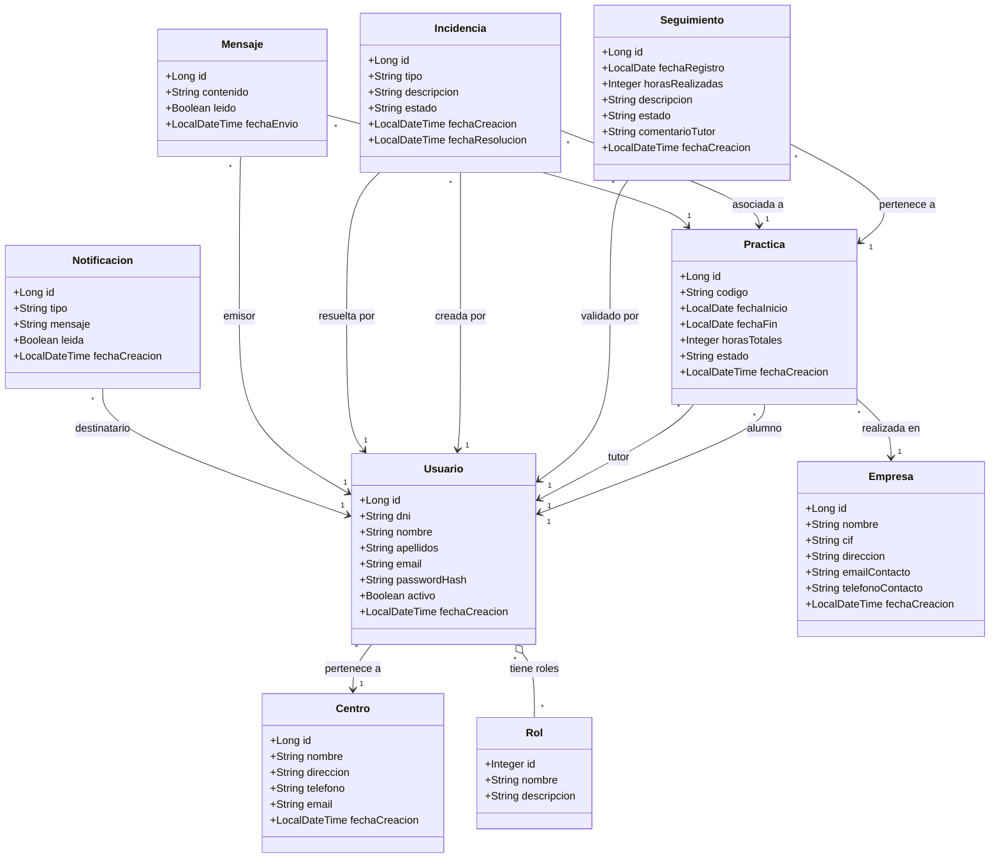

# Diagrama de Clases UML - TFG Nexus

Representación lógica del sistema basada en el modelo de datos.

```mermaid
classDiagram
    class Centro {
        +Long id
        +String nombre
        +String direccion
        +String telefono
        +String email
        +LocalDateTime fechaCreacion
    }
    class Usuario {
        +Long id
        +String dni
        +String nombre
        +String apellidos
        +String email
        +String passwordHash
        +Boolean activo
        +LocalDateTime fechaCreacion
    }
    class Rol {
        +Integer id
        +String nombre
        +String descripcion
    }
    class Empresa {
        +Long id
        +String nombre
        +String cif
        +String direccion
        +String emailContacto
        +String telefonoContacto
        +LocalDateTime fechaCreacion
    }
    class Practica {
        +Long id
        +String codigo
        +LocalDate fechaInicio
        +LocalDate fechaFin
        +Integer horasTotales
        +String estado
        +LocalDateTime fechaCreacion
    }
    class Seguimiento {
        +Long id
        +LocalDate fechaRegistro
        +Integer horasRealizadas
        +String descripcion
        +String estado
        +String comentarioTutor
        +LocalDateTime fechaCreacion
    }
    class Incidencia {
        +Long id
        +String tipo
        +String descripcion
        +String estado
        +LocalDateTime fechaCreacion
        +LocalDateTime fechaResolucion
    }
    class Mensaje {
        +Long id
        +String contenido
        +Boolean leido
        +LocalDateTime fechaEnvio
    }
    class Notificacion {
        +Long id
        +String tipo
        +String mensaje
        +Boolean leida
        +LocalDateTime fechaCreacion
    }

    Usuario "*" --> "1" Centro : pertenece a
    Usuario "*" o-- "*" Rol : tiene roles
    Practica "*" --> "1" Usuario : alumno
    Practica "*" --> "1" Usuario : tutor
    Practica "*" --> "1" Empresa : realizada en
    Seguimiento "*" --> "1" Practica : pertenece a
    Seguimiento "*" --> "1" Usuario : validado por
    Incidencia "*" --> "1" Practica : asociada a
    Incidencia "*" --> "1" Usuario : creada por
    Incidencia "*" --> "1" Usuario : resuelta por
    Mensaje "*" --> "1" Practica : contexto
    Mensaje "*" --> "1" Usuario : emisor
    Notificacion "*" --> "1" Usuario : destinatario
```
