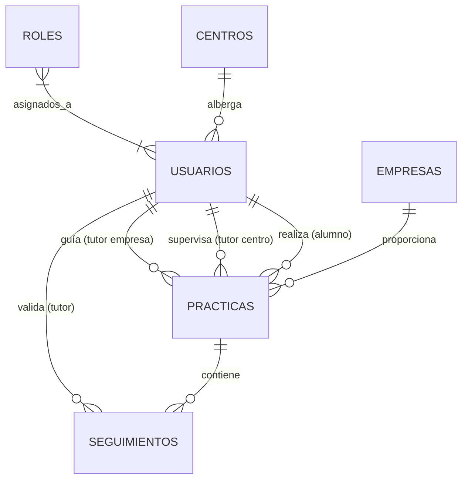

# Nexus TFG: Gestión de Prácticas Académicas - Memoria de Seguimiento
**Proyecto:** Nexus-API (Backend)  
**Autor:** Estudiante TFG  
**Fecha de Entrega:** Martes, 7 de abril de 2026  
**Estado:** Hito 1 - Core de Seguridad y Modelo de Datos Finalizado

---

## 1. Resumen Ejecutivo
Nexus es una plataforma centralizada diseñada para coordinar las Prácticas en Centros de Trabajo (FCT) y la FP Dual. El sistema permite la interacción en tiempo real entre tres actores clave: el **Alumno**, el **Tutor de Centro** y el **Tutor de Empresa**, bajo la supervisión de un **Administrador**. 

Esta primera entrega se centra en la cimentación tecnológica: la arquitectura de servicios, el modelo de datos relacional y el sistema de seguridad basado en tokens.

## 2. Decisiones Arquitectónicas (Justificación Técnica)

### 2.1 Stack Tecnológico
*   **Java 21 (LTS):** Se han empleado *Records* para los DTOs, garantizando inmutabilidad y reduciendo el código repetitivo (*boilerplate*).
*   **Spring Boot 3.4.1:** Marco de trabajo principal por su robustez en entornos empresariales y su integración nativa con Spring Security.
*   **PostgreSQL:** Motor de base de datos relacional elegido por su soporte estricto de integridad referencial, crítico para gestionar convenios de prácticas.
*   **Flyway:** Herramienta de migración de base de datos que permite un control de versiones del esquema SQL, facilitando el despliegue y la reproducibilidad del entorno.

### 2.2 Estrategia de Seguridad (Stateless JWT)
Se ha implementado una arquitectura de seguridad **Stateless** utilizando **JSON Web Tokens (JWT)**.
*   **Razón:** Al ser una API destinada a ser consumida por un cliente Flutter (móvil/web), el uso de sesiones tradicionales (JSESSIONID) es ineficiente. JWT permite que el servidor no guarde estado, delegando la identidad al cliente de forma cifrada.
*   **Cifrado:** Las contraseñas se protegen mediante el algoritmo **BCrypt**, cumpliendo con los estándares de seguridad de la industria.

### 2.3 Separación de Responsabilidades (DTOs y Mappers)
Para evitar el acoplamiento entre la base de datos y la API, se ha implementado la capa de **MapStruct**.
*   **Impacto:** Las entidades JPA nunca se exponen directamente al frontend. Esto previene fugas de información sensible (como hashes de contraseñas) y permite que la API evolucione independientemente del esquema de base de datos.

---

## 3. Modelo de Datos y Diseño del Sistema

### 3.1 Diagrama de Entidad-Relación (Base de Datos)
El diseño se ha normalizado para evitar redundancias y asegurar la consistencia. Una decisión crítica ha sido la **separación de tutores** en la entidad `Practica`, permitiendo que un alumno tenga un responsable académico y uno profesional distintos, reflejando la realidad de la FP Dual.

### 3.2 Diagrama de Clases UML (Backend)
Se ha seguido un diseño orientado a objetos con alta cohesión y bajo acoplamiento, utilizando tipos de datos modernos de Java (LocalDate, LocalDateTime).

---

## 4. Funcionalidades Implementadas

| Módulo | Descripción | Estado |
|--------|-------------|--------|
| **Core API** | Configuración de Spring Boot, Maven y dependencias. | Completado |
| **Persistencia** | Esquema inicial SQL con Flyway (V1 y V2). | Completado |
| **Seguridad** | Filtro JWT, AuthenticationManager y BCrypt. | Completado |
| **Auth API** | Endpoints de Registro y Login (`/api/auth`). | Completado |
| **Excepciones** | Interceptor global (`@RestControllerAdvice`) para errores estandarizados. | Completado |
| **Maestros** | Definición de Entidades para Centros y Empresas. | Modelado |

---

## 5. Próximos Pasos (Hito 2)
1.  **Flexibilización del Registro:** Permitir el alta de usuarios con roles administrativos y vinculación a centros específicos.
2.  **Módulo de Gestión de Convenios:** Implementación de la lógica de negocio para crear y activar prácticas.
3.  **Diario de Seguimiento:** Desarrollo del sistema de registro de horas diarias para el perfil de alumno.

---
*Este documento refleja el estado actual del repositorio en GitHub enviado para la revisión del tutor.*
